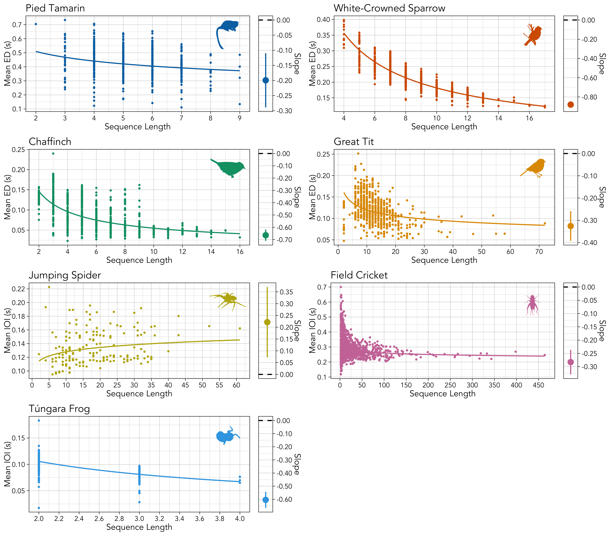

# Code for *Acoustic Efficiency and Flexibility in Anthropogenic Noise: A Multispecies Test of the Menzerath-Altmann Law*

This repository contains an analysis of how anthropogenic noise affects vocal efficiency in a variety of taxa, led by [Siddharth Satishchandran](https://anthro.ufl.edu/2023/08/12/siddharth-satishchandran/).

